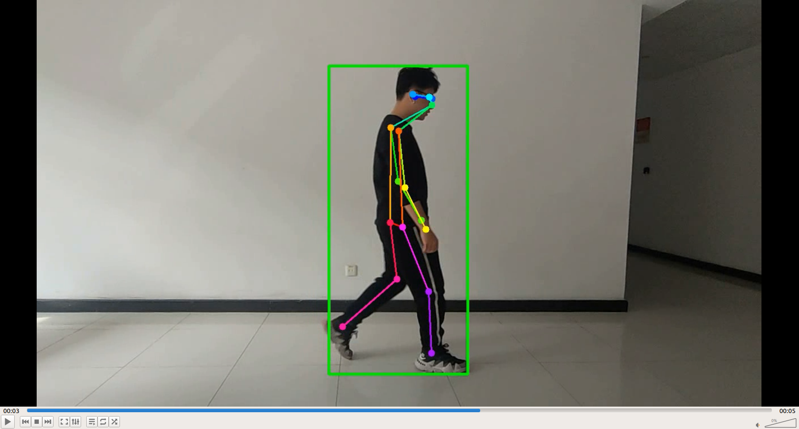
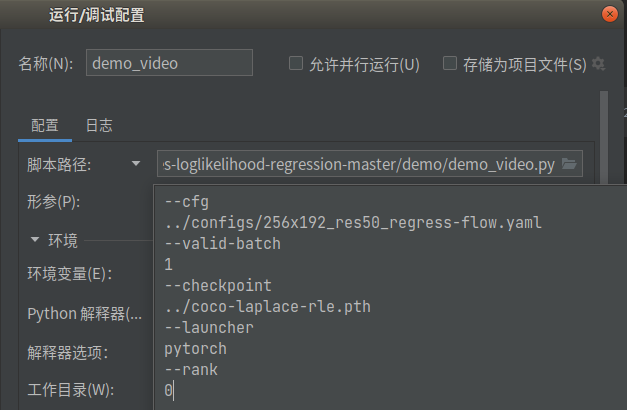
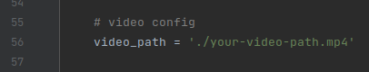
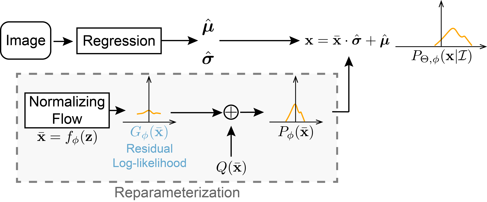

# RLE with COCO Human Pose Video Demo

### Result Example
<div align="center">
    <br>
    Video Demo Example
</div>


### Quick Start
1. Install pytorch >= 1.1.0 following official instruction.

2. Install `rlepose`:
``` bash
pip install cython
python setup.py develop
```
3. Install [COCOAPI](https://github.com/cocodataset/cocoapi).
``` bash
pip install pycocotools
```
4. Init `data` directory:
``` bash
mkdir data
```
5. Download [COCO](https://cocodataset.org/#download) data, [MPII](http://human-pose.mpi-inf.mpg.de/#download) ([annotations](https://drive.google.com/file/d/1--EQZnCJI_XJIc9_bw-dzw3MrRFLMptw/view?usp=sharing)) and [Human3.6M](https://drive.google.com/drive/folders/1kgVH-GugrLoc9XyvP6nRoaFpw3TmM5xK) data (from [PoseNet](https://github.com/mks0601/3DMPPE_POSENET_RELEASE) or [ours](https://drive.google.com/drive/folders/1sF2xjAfvEw7rvNaQJqadAU2QDUVFfhQH?usp=sharing)):
```
|-- data
`-- |-- coco
    |   |-- annotations
    |   |   |-- person_keypoints_train2017.json
    |   |   `-- person_keypoints_val2017.json
    |   `-- images
    |       |-- train2017
    |       |   |-- 000000000009.jpg
    |       |   |-- 000000000025.jpg
    |       |   |-- 000000000030.jpg
    |       |   |-- ... 
    |       `-- val2017
    |           |-- 000000000139.jpg
    |           |-- 000000000285.jpg
    |           |-- 000000000632.jpg
    `--           |-- ... 

```
## Training

### Train on MSCOCO
``` bash
./scripts/train.sh ./configs/256x192_res50_regress-flow.yaml train_rle_coco
```

## Evaluation

### Validate on MSCOCO
Download the pretrained model from [Google Drive](https://drive.google.com/file/d/1YBHqNKkxIVv8CqgDxkezC-4vyKpx-zXK/view?usp=sharing).
``` bash
./scripts/validate.sh ./configs/256x192_res50_regress-flow.yaml ./coco-laplace-rle.pth
```

## Demo

### 1. Config like this figure
<div align="center">
    <br>
    Running Script Env Config 
</div>

Or you can directly copy this
```
--cfg
../configs/256x192_res50_regress-flow.yaml
--valid-batch
1
--checkpoint
../coco-laplace-rle.pth
--launcher
pytorch
--rank
0
```

### 2. Customize you video path in demo_video.py line 56.
<div align="center">
    <br>
    Customize video path 
</div>

## Information about RLE
[[`Paper`](https://jeffli.site/res-loglikelihood-regression/resources/ICCV21-RLE.pdf)]
[[`arXiv`](https://arxiv.org/abs/2107.11291)]
[[`Project Page`](https://jeffli.site/res-loglikelihood-regression/)]

> [Human Pose Regression with Residual Log-likelihood Estimation](https://jeffli.site/res-loglikelihood-regression/resources/ICCV21-RLE.pdf)  
> Jiefeng Li, Siyuan Bian, Ailing Zeng, Can Wang, Bo Pang, Wentao Liu, Cewu Lu  
> ICCV 2021 Oral  

<div align="center">
    <br>
    Regression with Residual Log-likelihood Estimation
</div>


### Acknowledgment
```
@inproceedings{li2021human,
    title={Human Pose Regression with Residual Log-likelihood Estimation},
    author={Li, Jiefeng and Bian, Siyuan and Zeng, Ailing and Wang, Can and Pang, Bo and Liu, Wentao and Lu, Cewu},
    booktitle={ICCV},
    year={2021}
}
```

### Contact
```
ligaoqi02@gmail.com
```